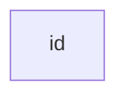
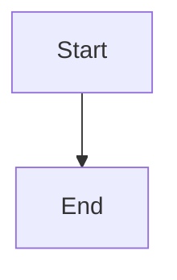
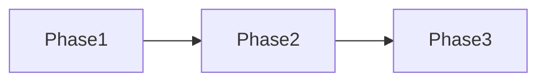
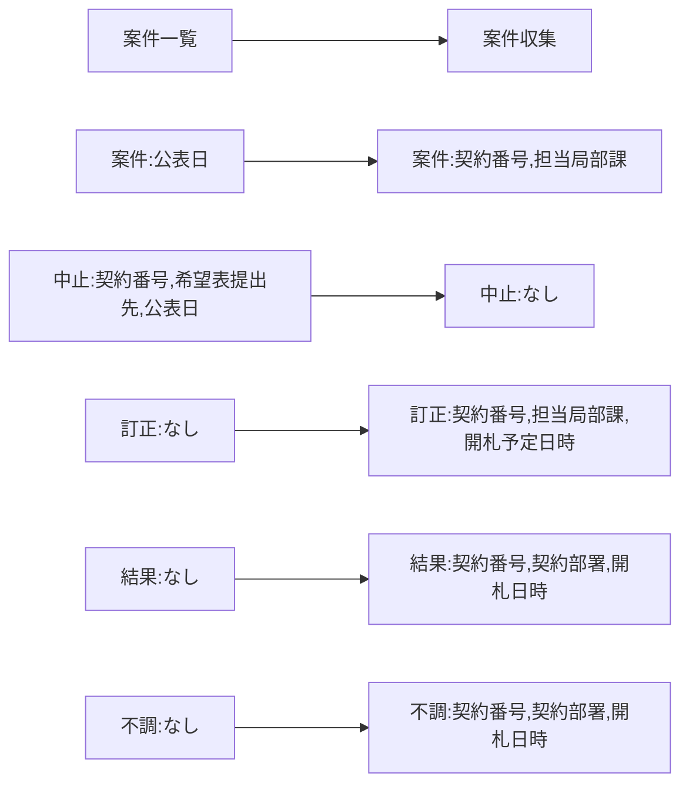

##  A node(default)

```mermaid
flowchart LR
id
```
## A node with text

```mermaid
flowchart LR
id1[this is the text in the box]
```

```mermaid
flowchart LR
id1(This is the text in the box)
```

## Graph

```mermaid
flowchart TD
    Start --> End
```

```mermaid
flowchart LR
    Phase1 --> Phase2 --> Phase3
```

```mermaid
flowchart LR
    案件一覧 --> 案件収集
    案件:公表日 --> 案件:契約番号,担当局部課
    中止:契約番号,希望表提出先,公表日-->中止:なし
    訂正:なし-->訂正:契約番号,担当局部課,開札予定日時
    結果:なし-->結果:契約番号,契約部署,開札日時
    不調:なし-->不調:契約番号,契約部署,開札日時
```